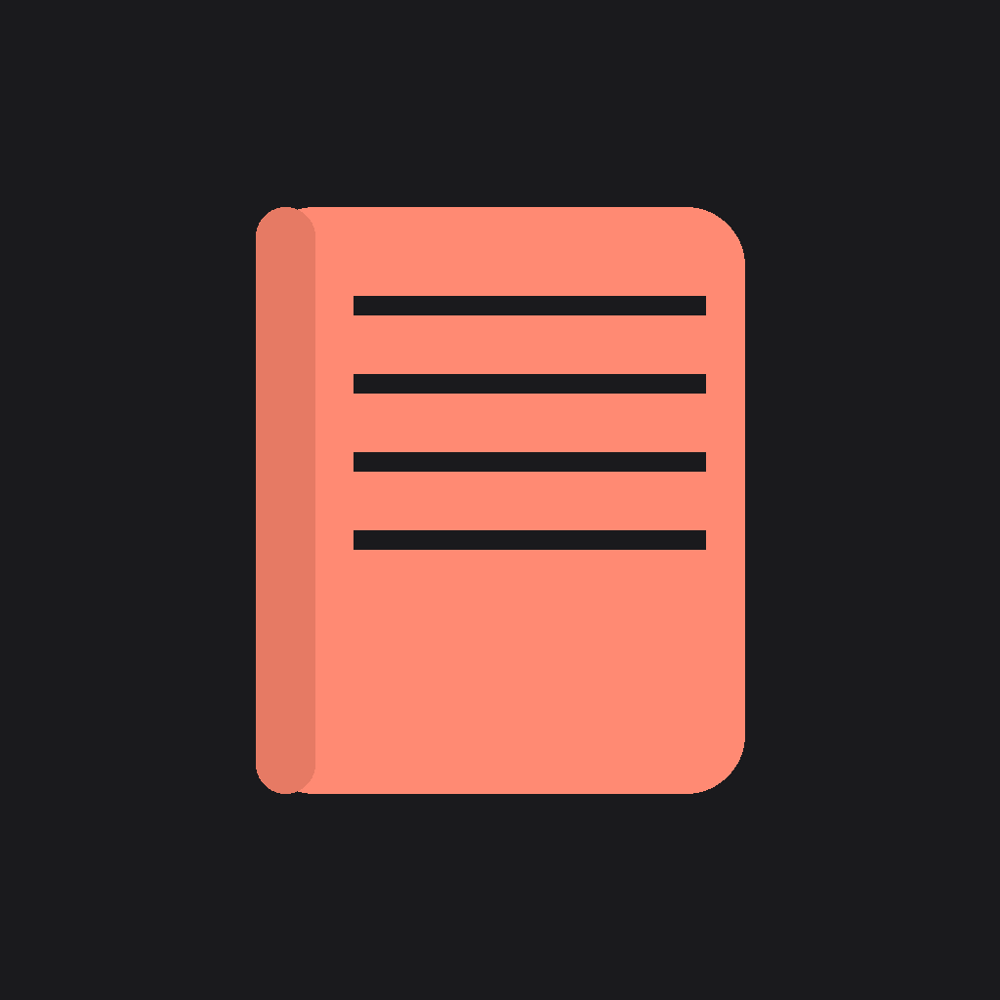

<p align="center">
  
</p>

<h1 align="center">Rythamo Day</h1>

<p align="center">
  <strong>A Personal Wellness Journal That Understands You</strong>
</p>

<p align="center">
  <a href="https://flutter.dev"></a>
  <a href="https://dart.dev"></a>
  <a href="https://riverpod.dev"></a>
</p>

---

## 📖 The Story

> *"What if journaling felt less like a chore and more like a conversation with yourself?"*

I noticed a pattern in my life—the days I reflected on my thoughts were the days I felt most centered. But traditional journaling apps felt cold, clinical, and overwhelming. They demanded too much and gave too little in return.

**Rythamo Day** was born from this frustration. Instead of staring at a blank page, users are greeted with thoughtful, rotating questions that spark genuine reflection. The app gamifies consistency with streaks, celebrates small wins, and wraps everything in a beautiful, calming Catppuccin-inspired aesthetic.

This isn't just a journaling app—it's a **daily companion for mental clarity**.

---

## ✨ Key Features

| Feature | Description |
|---------|-------------|
| 🎯 **Daily Questions** | Rotating prompts that inspire meaningful reflection without the blank-page anxiety |
| 😊 **Mood Tracking** | Visual mood logging with insights into emotional patterns over time |
| 🔥 **Streak System** | Gamified consistency tracking to build lasting journaling habits |
| 👤 **Custom Avatars** | Personalized Notion-style avatars to make the experience uniquely yours |
| 🎨 **Catppuccin Themes** | Beautiful, eye-friendly color palettes (Latte, Frappé, Macchiato, Mocha) |
| 📅 **History Calendar** | Browse past entries with a calendar view for pattern recognition |
| 🔔 **Smart Reminders** | Gentle notifications to encourage daily reflection |
| 🔒 **Privacy First** | All data stored locally—no cloud, no tracking, no compromises |

---

## 🏗️ Technical Architecture

```
lib/
├── main.dart                 # App entry point with Riverpod setup
├── models/                   # Data models (DailyEntry, JournalEntry)
├── providers/                # Riverpod state management
├── screens/                  # UI screens
│   ├── home_screen.dart      # Main dashboard with dock navigation
│   ├── daily_questions_screen.dart  # Reflective prompts
│   ├── mood_screen.dart      # Mood tracking interface
│   ├── history_screen.dart   # Calendar-based history
│   ├── profile_screen.dart   # User settings & themes
│   └── onboarding_screen.dart # First-time user experience
├── services/                 # Business logic
│   ├── storage_service.dart  # SharedPreferences persistence
│   ├── notification_service.dart  # Awesome Notifications
│   └── avatar_service.dart   # Avatar customization
├── theme/                    # Catppuccin theming system
└── widgets/                  # Reusable UI components
```

### 🛠️ Tech Stack

| Category | Technology |
|----------|------------|
| **Framework** | Flutter 3.10+ |
| **State Management** | Riverpod 2.6+ with code generation |
| **Storage** | SharedPreferences (local, secure) |
| **Notifications** | Awesome Notifications |
| **Design System** | Catppuccin Flutter |
| **Animations** | Lottie |
| **Architecture** | Clean Architecture (separation of concerns) |

---

## 💡 Technical Decisions

### Why Riverpod over BLoC?
Riverpod provides compile-time safety, better testability, and eliminates the context dependency that often causes issues with BLoC. The code-generation features reduce boilerplate significantly.

### Why Local Storage Only?
Privacy is paramount for personal journaling. By storing everything on-device, users can journal with complete honesty without worrying about cloud security or data breaches.

### Why Catppuccin Theming?
Catppuccin's warm, low-saturation palettes reduce eye strain and create a calming environment—perfect for an app designed for daily reflection.

---

## 🚀 Getting Started

### Prerequisites
- Flutter SDK 3.10+
- Dart 3.0+

### Installation

```bash
# Clone the repository
git clone https://github.com/Rythamo8055/rythamo-day.git

# Navigate to project
cd rythamo-day

# Install dependencies
flutter pub get

# Run the app
flutter run
```

---

## 📸 Screenshots

<p align="center">
  <em>Coming soon! Beautiful screenshots of the onboarding, home, mood tracking, and themes.</em>
</p>

---

## 🎯 What I Learned

Building Rythamo Day taught me:
- **State management at scale** with Riverpod's code generation
- **Themeable design systems** using Catppuccin color tokens
- **Gamification psychology** to encourage habit formation
- **Local-first architecture** for privacy-focused applications
- **Notification scheduling** for optimal user engagement

---

## 👨‍💻 About the Developer

<p align="center">
  
</p>

I'm a passionate mobile developer focused on creating beautiful, functional applications that solve real problems. I believe in writing clean code, thoughtful UX, and building products that people actually want to use.

### 📬 Let's Connect!

<p align="center">
  <a href="https://www.linkedin.com/in/vishnu-vardhan8055/"></a>
  <a href="mailto:vishnuvardhanthe8055@gmail.com"></a>
  <a href="https://vishnuvardhanm.vercel.app/"></a>
</p>

---

<p align="center">
  <strong>🌟 If this project resonates with you, I'd love to connect!</strong>
</p>

<p align="center">
  <em>Open for opportunities in mobile development, Flutter consulting, and collaborative projects.</em>
</p>

---

<p align="center">
  Made with ❤️ and a lot of ☕
</p>
